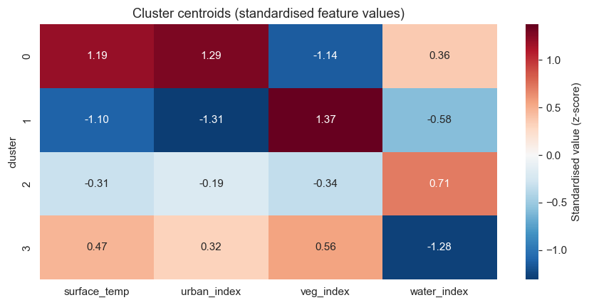
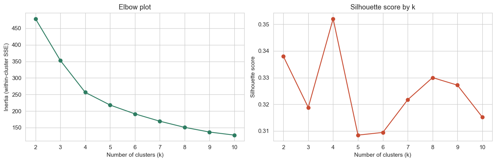
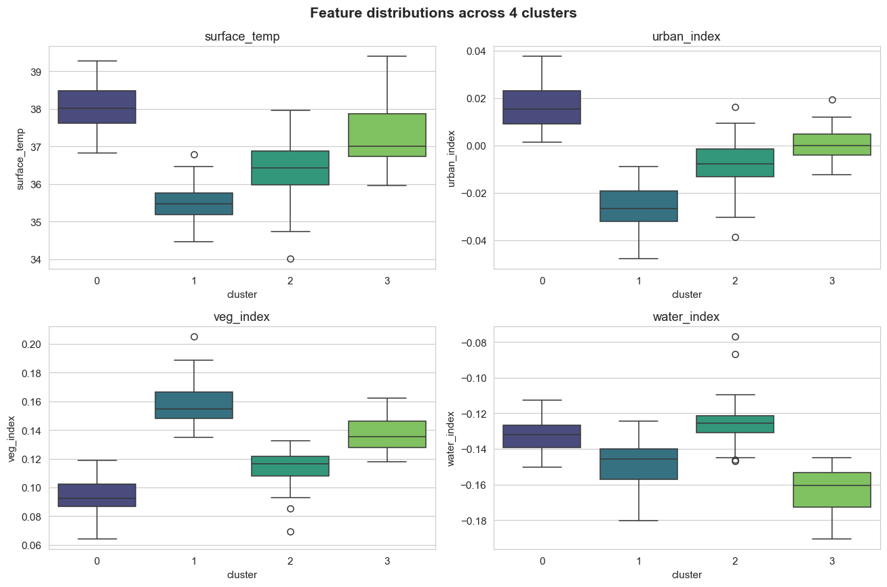
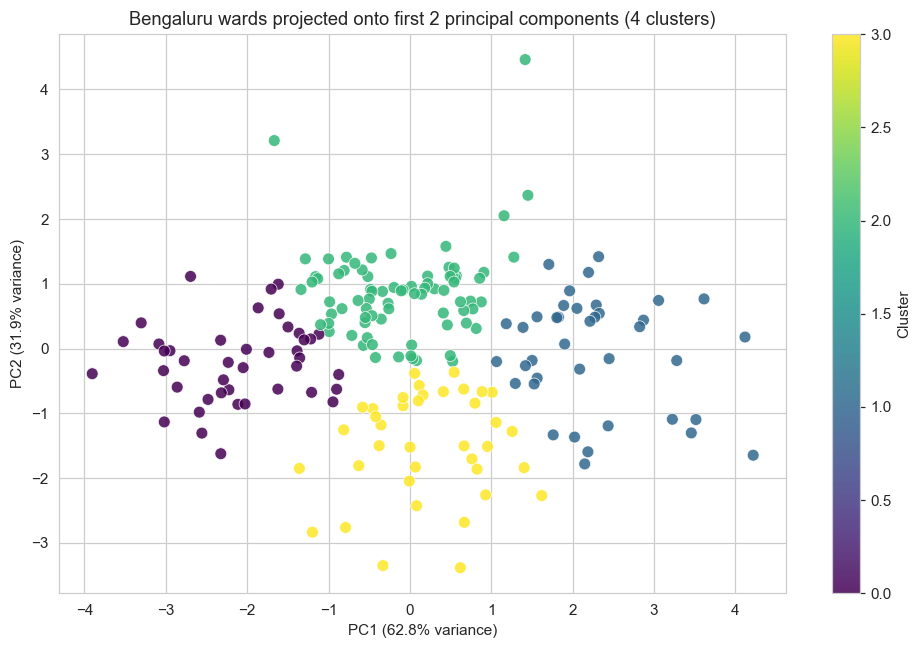
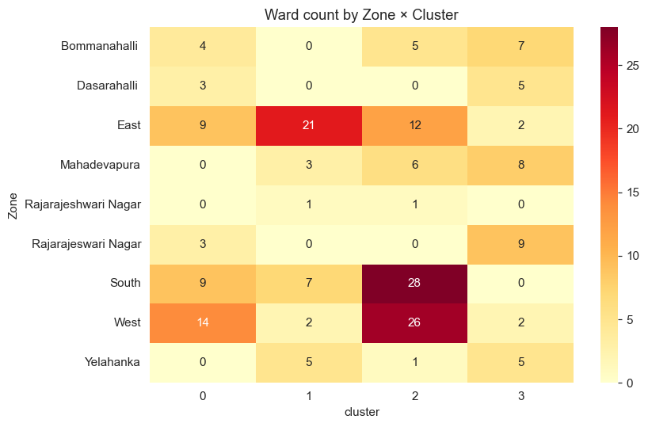

# Bengaluru Ward Climate-Vulnerability Clustering

**Unsupervised K-Means clustering of 198 BBMP wards into four distinct climate-vulnerability archetypes, using satellite-derived surface temperature, urbanisation, vegetation, and water indices. Built as foundational research for the [Bengaluru Quorum](https://linkedin.com/company/bengaluru-quorum) climate-intelligence platform.**

   



---

## Why this exists

Bengaluru's 198 wards are usually ranked by a single number — average temperature, slum density, water shortage incidents — and "vulnerability" is treated as a 1-D problem. It isn't. A ward that is hot *and* densely built needs different interventions from one that is hot *and* water-stressed *and* low-density. **Clustering exposes these joint structures that a single ranked list cannot.**

This project takes four standardised ward-level climate features and asks the data, without supervision, how many distinct ward-types Bengaluru actually has and what makes each one its own thing.

---

## Results — four interpretable archetypes

K-Means found **k = 4** as the best fit by silhouette score (0.352 at k=4, the highest across k=2..10), confirmed by the elbow plot. The four clusters tell a coherent story when projected back to the original feature scale:

| Cluster | Size | Surface temp (°C) | Urban index | Veg index | Water index | Archetype |
|---|---|---|---|---|---|---|
| **0** | 42 wards | **38.0** (hottest) | **+1.29** (densest built) | −1.14 (lowest green) | +0.36 | **Concrete heat islands** |
| **1** | 39 wards | **35.5** (coolest) | −1.31 (low-density) | **+1.37** (greenest) | −0.58 | **Green peri-urban** |
| **2** | 79 wards | 36.4 (neutral) | −0.19 | −0.34 | **+0.71** (water-rich) | **Lake-adjacent moderate-density** |
| **3** | 38 wards | 37.3 (warm) | +0.32 | +0.56 | **−1.28** (water-stressed) | **Water-stressed mixed** |

(Z-scores in the centroid heatmap; raw °C / index values in the table above.)

### What each cluster contains in practice

- **Cluster 0 — Concrete heat islands.** Representative wards: *Rajagopal Nagar, K R Market, Hegganahalli.* These are the wards that appear at the top of the cool-roof prioritization in the [companion UHI repo](https://github.com/Rupali-Gauravaram/bengaluru-uhi-prediction) — independent unsupervised validation of the same intervention list.
- **Cluster 1 — Green peri-urban.** Representative wards: *Devara Jeevanahalli, Shanthi Nagar, Jakkasandra.* Cool, leafy, low-density. These are the wards Bengaluru is *trying to preserve* and which need pre-emptive zoning, not retrofit.
- **Cluster 2 — Lake-adjacent moderate-density.** The biggest group (79 wards). Representative wards: *Subhash Nagar, Gandhinagar, Agrahara Dasarahalli.* Average on temperature and built-up, but with significantly above-average water-body proximity. These wards have *latent green-blue infrastructure capital* — lakes and waterways waiting to be designed around.
- **Cluster 3 — Water-stressed mixed.** Representative wards: *Kengeri, Peenya Industrial Area, Anjanapura.* Warm, somewhat-dense, with some green cover but a **critical water deficit (z = −1.28)**. These wards need *water* interventions first, not just thermal ones.

---

## Diagnostics

### Picking k — elbow + silhouette



The elbow softens around k=4, and silhouette peaks at k=4 (0.352). Higher k values fragment the data without meaningfully improving cohesion. Lower k values (k=2, k=3) collapse meaningfully distinct ward profiles into one group.

### Feature distributions across clusters



Each cluster occupies a distinct region of the feature space on multiple axes — they are not just "hot vs cool" splits. Cluster 3 has visibly lower water index even when surface temp overlaps with cluster 2; cluster 1 separates cleanly on veg_index from all others.

### PCA projection — two components explain 94.7% of variance



PC1 captures **62.8%** of variance, PC2 captures **31.9%** — together **94.7%**. This high recoverability in 2D means the four-cluster structure isn't a high-dimensional artefact; it's a real and visualisable signal in the data.

### Where do clusters live geographically?



The clusters are not uniformly distributed across administrative zones:
- **Cluster 0 (concrete heat islands)** concentrates in **West (14), East (9), South (9)**, and is *absent* from Yelahanka.
- **Cluster 1 (green peri-urban)** is heavily concentrated in **East (21)** and **Yelahanka (5)** — the city's leafier eastern fringe.
- **Cluster 3 (water-stressed)** dominates **Rajarajeswari Nagar (9), Mahadevapura (8), Bommanahalli (7)** — the rapidly-expanding peripheral zones where utility infrastructure has lagged growth.

This zonal pattern matches lived experience of the city and lends qualitative credibility to the clustering.

---

## Method

1. **Data:** 198 BBMP wards × 4 features (surface_temp, urban_index, veg_index, water_index), sourced from the long-term mean of MODIS LST (2022–2024) and Sentinel-2 derived land-use indices, aggregated to ward geometry via Google Earth Engine.
2. **Preprocessing:** No missing values in the feature set after sourcing. `StandardScaler` applied — necessary because features have very different magnitudes (surface_temp ~35–39, urban_index ~−0.05 to 0.04).
3. **Model selection:** K-Means fitted for k = 2..10, with `n_init=20` to avoid bad random initialisations. Best k chosen by **silhouette score**, with elbow plot as a sanity check.
4. **Final fit:** k = 4 with `n_init=50` for stability.
5. **Interpretation:** centroids inverse-transformed back to original feature units; profiles validated by inspecting top-3 wards per cluster against domain knowledge of Bengaluru.

---

## Intuition — what surprised me

> **The Bengaluru "vulnerability map" is two-dimensional, not one.** Most public discourse treats UHI severity as the headline number — "this ward is hot, do something about it." The clusters show that water stress is *orthogonal* to thermal stress. Cluster 3 wards are not as hot as Cluster 0, but they are far more water-stressed. A retrofit budget that goes only to the hottest wards misses the wards that will face the next *water* crisis.

> **K-Means worked here because the feature space is roughly convex.** I tried DBSCAN as an alternative — it lumped 90% of wards into one mega-cluster and flagged a long tail as noise, which is what DBSCAN does when there isn't a strong density-gap. The fact that K-Means produces 4 well-separated, interpretable groups (silhouette 0.352, well above the chance baseline) is itself information: ward profiles vary continuously along a few latent axes, not in dense pockets with empty space between them.

> **The bookend clusters (0 and 1) have opposite signs on three of four features.** Cluster 0 is +1.19 hot, +1.29 built, −1.14 green; Cluster 1 is −1.10 cool, −1.31 less-built, +1.37 greener. This is the classical UHI gradient. The *interesting* clusters are 2 and 3, which sit between the bookends but are differentiated almost entirely by the water axis. That axis would have been invisible in a 1-D ranking.

> **Cluster 0 independently rediscovers the cool-roof priority list.** Without ever seeing the LST regression output from the [companion UHI repo](https://github.com/Rupali-Gauravaram/bengaluru-uhi-prediction), K-Means surfaces Rajagopal Nagar, Hegganahalli, and similar wards as the "concrete heat island" cluster. Two independent methods (supervised regression and unsupervised clustering) converging on the same intervention list is strong cross-validation that the underlying signal is real.

---

## Limitations (honest read)

- **198 wards, not 369.** This work uses the older BBMP ward boundaries (consistent with my LST/UHI repos) because that dataset has the fully-extracted satellite features. The current Greater Bengaluru Authority has 369 wards; re-extracting the climate features for the new boundary is a separate piece of data-engineering work and would be the natural next step.
- **Four features only.** Adding population density, slope/elevation, drainage proximity, and historical flood incidence would likely separate the "water-stressed" cluster into a flood-prone vs water-deficient sub-split.
- **Snapshot, not trajectory.** Features are long-term means. A ward that *was* green in 2022–2024 but is being rapidly built up today will still cluster as "green peri-urban" — the data lags reality.
- **K-Means assumes spherical, equal-variance clusters.** Cluster 2 (n=79) is disproportionately large; a Gaussian Mixture Model would let cluster variances differ and might split it.
- **No spatial autocorrelation.** Two wards with similar feature values cluster together regardless of distance. A spatially-constrained clustering (SKATER, ClustGeo) would force geographically contiguous clusters — more useful for planning interventions, less useful for typology discovery. Both are valid; this project chose typology.

---

## Project structure

```
bengaluru-ward-climate-clustering/
├── data/
│   ├── Bengaluru_Ward_Master_Stats.csv       # 198 wards × 4 features (input)
│   ├── Bengaluru_Ward_Temp_Stats.csv         # Raw LST extracts
│   ├── Bengaluru_Ward_Urban_Stats.csv        # Raw urbanisation extracts
│   ├── Bengaluru_Ward_Veg_Stats.csv          # Raw vegetation extracts
│   ├── Bengaluru_Ward_Water_Stats.csv        # Raw water-index extracts
│   ├── wards_with_clusters.csv               # Output: 198 wards + cluster label
│   └── cluster_profiles.csv                  # Output: per-cluster feature means
├── figures/
│   ├── elbow_silhouette.png
│   ├── feature_distributions.png
│   ├── pca_scatter.png
│   ├── centroid_heatmap.png
│   └── zone_cluster_heatmap.png
├── run_analysis.py                           # End-to-end reproducible script
├── requirements.txt
├── LICENSE
└── README.md
```

---

## Reproduce

```bash
git clone https://github.com/Rupali-Gauravaram/bengaluru-ward-climate-clustering.git
cd bengaluru-ward-climate-clustering
pip install -r requirements.txt
python run_analysis.py
```

Outputs are deterministic (`random_state=42`).

---

## Related work

- **[bengaluru-uhi-prediction](https://github.com/Rupali-Gauravaram/bengaluru-uhi-prediction)** — supervised LST prediction + cool-roof prioritization on the same 198-ward dataset. Cluster 0 of this repo rediscovers the priority list of that repo.
- **[Bengaluru_LST_Prediction_API](https://github.com/Rupali-Gauravaram/Bengaluru_LST_Prediction_API)** — the original v1 API that this body of work extends.
- **Bengaluru Quorum** ([LinkedIn](https://linkedin.com/company/bengaluru-quorum)) — the climate-intelligence platform these ward archetypes feed into.

---

## Author

**Rupali Gauravaram** — Climate Tech ML Engineer, founder of [Bengaluru Quorum](https://linkedin.com/company/bengaluru-quorum). MSc Climate Resilience & Environmental Sustainability (University of Liverpool, 2024). Currently completing Advanced AI/ML certification at IIT Roorkee (May 2026).

[LinkedIn](https://linkedin.com/in/rupali99) · [GitHub](https://github.com/Rupali-Gauravaram) · [Blog: Chai & Code](https://chaiandcode.wordpress.com)
